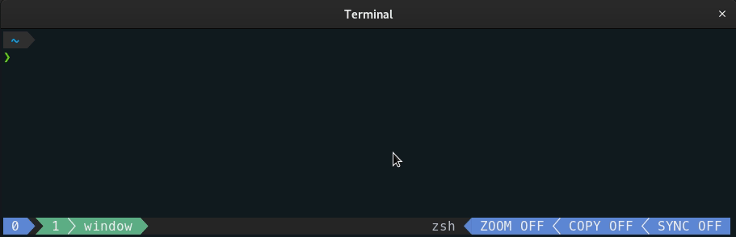

# zsh-tmux-auto-title

ZSH plugin for tmux that automatically sets the title of windows/panes as the current foreground command.



## Installation

### Manual

```
git clone --depth=1 https://github.com/mbenford/zsh-tmux-auto-title ~/zsh-tmux-auto-title
echo "source ~/zsh-tmux-auto-title/zsh-tmux-auto-title.plugin.zsh" >>! ~/.zshrc
```

### Oh My Zsh:

```
git clone --depth=1 https://github.com/mbenford/zsh-tmux-auto-title ${ZSH_CUSTOM:~/.oh-my-zsh/custom}/plugins
```

Add `zsh-tmux-auto-title` to `plugins` in `.zshrc`.

## Usage

Once enabled, this plugin will automatically set the title of the current window/pane as the current command, by issuing escape sequences that tmux understands. By default the whole command line will be used, but you can make it shorter if you want. You can also set what the window/pane title will be when no command is running.

## Configuration

| Variable | Description |
|-|-|
| `ZSH_TMUX_AUTO_TITLE_TARGET` | Sets whether the `window` title or the `pane` title should be changed. Defaults to `pane`. |
| `ZSH_TMUX_AUTO_TITLE_SHORT` | Displays only the command name, instead of the full command line. Defaults to `false`. |
| `ZSH_TMUX_AUTO_TITLE_SHORT_EXCLUDE` | Regular expression that defines what commands should never be shortened. Defaults to `""`. |
| `ZSH_TMUX_AUTO_TITLE_EXPAND_ALIASES` | Determines whether aliases should be expanded or kept as is. Defaults to `true`. |
| `ZSH_TMUX_AUTO_TITLE_IDLE_TEXT` | Text to be used when no command is running. It can be either a plain string or one of the following variables: <br>`%pwd`: current directory; <br>`%shell`: current shell;<br>`%last`: last command, prefixed by an exclamation mark.<br>Defaults to `%shell`. |
| `ZSH_TMUX_AUTO_TITLE_IDLE_DELAY` | Delay, in seconds, before the idle text is displayed. Defaults to `1`. |